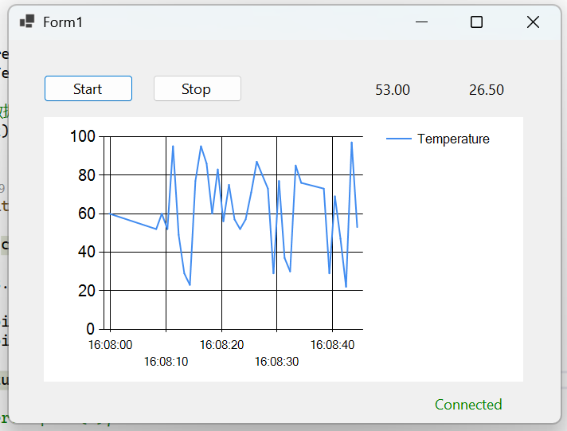

# AntApp – Industrial Equipment Monitoring System

## 📌 Overview

**AntApp** is a WinForms-based industrial monitoring system designed to simulate real-world equipment control software used in manufacturing and semiconductor environments.

The system demonstrates:
- Real-time data acquisition via TCP
- Automatic reconnection and heartbeat monitoring
- Multi-threaded data processing pipeline
- UI decoupling using producer-consumer pattern
- Time-series data storage (PostgreSQL)
- Structured logging (Serilog)
- Device simulator for offline development

---

## 🧱 Architecture

```
AntApp
├── AntApp.WinForms          # UI Layer
├── AntApp.Application       # Business Logic
├── AntApp.Domain            # Entities / Models
├── AntApp.Infrastructure
│   ├── Communication        # TCP Client
│   ├── Persistence          # PostgreSQL (Dapper)
│   ├── Logging              # Serilog
└── AntApp.Simulator         # TCP Device Simulator
```

---

## ⚙️ Tech Stack

| Layer         | Technology         |
|---------------|--------------------|
| UI            | WinForms (.NET 9)  |
| Communication | TCP Socket         |
| Data Pipeline | BlockingCollection |
| Database      | PostgreSQL         |
| ORM           | Dapper             |
| Logging       | Serilog            |
| Config        | appsettings.json   |

---

## 🚀 Features

### 1. Device Communication
- TCP-based client-server communication
- JSON-based data protocol
- Supports multiple concurrent connections

### 2. Connection Reliability
- State machine: `Disconnected` → `Connecting` → `Connected` → `Reconnecting`
- Automatic reconnection
- Heartbeat monitoring

### 3. Real-time Data Processing
- Producer-consumer architecture:
  ```
  TCP Thread → BlockingCollection → UI Thread
  ```
- Prevents UI blocking under high-frequency data

### 4. Real-time Visualization
- Live temperature & pressure display
- Sliding window chart (performance optimized)
- Controlled refresh rate

### 5. Data Persistence
- PostgreSQL storage
- High-performance inserts using Dapper
- Connection managed via `ConnectionFactory`

### 6. Logging & Diagnostics
- Structured logging via Serilog
- Log levels: Debug / Info / Warning / Error
- Rolling file logs
- Global exception handling for:
  - UI thread
  - Background tasks
  - Unhandled exceptions

### 7. Device Simulator
- Independent TCP server
- Simulates:
  - Real-time telemetry
  - Random disconnections
- Enables development without physical hardware

---

## 🖥️ How to Run

### 1. Start Simulator
```bash
dotnet run --project AntApp.Simulator
```

### 2. Start WinForms App
```bash
dotnet run --project AntApp.WinForms
```

### 3. Click "Start" in UI

You should see:
- Real-time data updates
- Chart animation
- Connection state changes
- Auto-reconnect on disconnect

---

## 📡 Data Protocol

Example JSON message:
```json
{
  "Temperature": 45.2,
  "Pressure": 22.6
}
```

> **Note:** TCP stream uses newline (`\n`) as message delimiter to avoid packet sticking issues.

---

## 📸 Screenshots


*Real-time machine status and telemetry*

---

## 🧠 Key Design Decisions

| Decision | Reason |
|----------|--------|
| TCP | Common in industrial equipment, lightweight, flexible |
| BlockingCollection | Thread-safe producer-consumer, decouples acquisition from UI |
| Dapper (not full ORM) | Better performance for high-frequency writes, full SQL control |
| Serilog | Structured logging, flexible `appsettings.json` configuration |
| Device Simulator | Enables development without real PLC, tests fault scenarios |

---

## 📊 System Workflow

```
[Simulator]
    ↓ TCP
[TcpDeviceClient]
    ↓
[BlockingCollection Queue]
    ↓
[UI Thread]
    ↓
[Chart + Labels]
    ↓
[PostgreSQL]
```

---

## ⚠️ Challenges & Solutions

| Challenge | Solution |
|-----------|----------|
| TCP packet fragmentation / stickiness | Newline-delimited messages |
| UI freezing | Queue decoupling + throttling |
| Connection instability | State machine + retry loop + heartbeat |
| High-frequency data load | Bounded queue + sliding window chart + controlled refresh rate |

---

## 📈 Future Improvements

- OPC UA integration
- Multi-device dashboard
- Alarm system
- Historical trend analysis
- WPF version (MVVM architecture)

---

## 🎯 Interview Highlights

This project demonstrates:
- Industrial communication patterns
- Real-time system design
- Multi-threading and concurrency control
- Fault-tolerant architecture
- Practical engineering trade-offs

---

## 👤 Author Notes

This project is designed as a realistic industrial software demo, focusing on:
- **Stability**
- **Performance**
- **Maintainability**
- **Observability**
```

---

